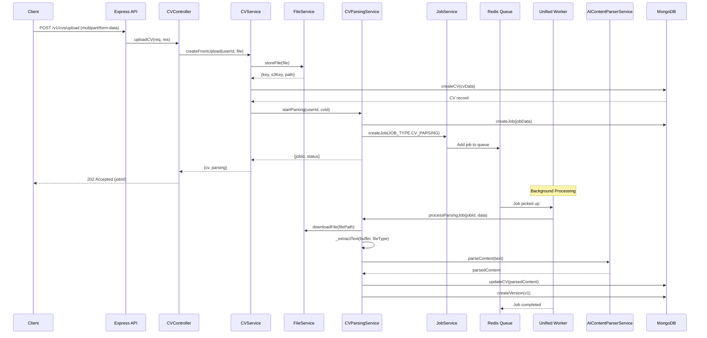

# CV Upload and Parsing - Complete Process Documentation

## Overview

The CV upload and parsing process in CareerForge is a multi-stage, asynchronous pipeline that transforms a PDF file into structured, AI-parsed CV data. This document traces the complete flow from HTTP request to final parsed result.

---

## Architecture Diagram



---

## Step-by-Step Process

### Phase 1: HTTP Request Handling

#### 1.1 API Endpoint
```
POST /v1/cvs/upload
Content-Type: multipart/form-data
Authorization: Bearer <token>
```

**File:** `src/modules/cvs/routes/cv.routes.js`

```javascript
router.post('/upload', uploadMiddleware.single('file'), cvController.uploadCV.bind(cvController));
```

**Middleware Chain:**
1. `authMiddleware` - Validates JWT token, extracts `userId`
2. `uploadMiddleware.single('file')` - Multer processes multipart file upload

#### 1.2 Controller Layer
**File:** `src/modules/cvs/controllers/cv.controller.js`

The `uploadCV` method:
- Extracts `userId` from `req.userId` (set by auth middleware)
- Extracts `file` from `req.file` (set by multer)
- Calls `CVService.createFromUpload()`
- Returns HTTP 202 Accepted with job info

```javascript
async uploadCV(req, res, next) {
  const userId = req.userId;
  const file = req.file;
  const result = await this.service.createFromUpload(userId, file, req.body.title);
  res.status(202).json(ResponseFormatter.resource(result));
}
```

---

### Phase 2: File Storage & CV Record Creation

#### 2.1 CV Service
**File:** `src/modules/cvs/services/cv.service.js`

The `createFromUpload` method orchestrates:

1. **File Storage** (FileService)
   ```javascript
   fileInfo = await this.fileService.storeFile(file);
   // Returns: { key: 'uploads/uuid.pdf', s3Key: 'optional-s3-key', path: '/local/path' }
   ```

2. **CV Record Creation** (Atomic Transaction)
   ```javascript
   const cvData = {
     title: customTitle || file.originalname.replace(/\.[^/.]+$/, ''),
     userId,
     source: 'upload',
     metadata: {
       originalFilename: file.originalname,
       fileSize: file.size,
       mimeType: file.mimetype,
       filePath: fileInfo.key,
       uploadedAt: new Date(),
     },
   };
   const cv = await this.cvRepository.createCV(cvData);
   ```

3. **Start Parsing Job**
   ```javascript
   parsingJob = await this.cvParsingService.startParsing(userId, cv.id, {});
   ```

---

### Phase 3: Job Queue Submission

#### 3.1 CV Parsing Service - Job Creation
**File:** `src/modules/cv-parsing/services/cv-parsing.service.js`

The `startParsing` method:

1. **Validation**
   - Verify CV exists and belongs to user
   - Check concurrent job limit (max 5 per user)

2. **Generate Job ID**
   ```javascript
   const jobId = this.idGenerator.generate(JOB_TYPE.CV_PARSING, userId);
   // Format: "parse_<userId>_<timestamp>_<random>"
   ```

3. **Create Parsing Job Record** (MongoDB)
   ```javascript
   parsingJob = await this.cvParsingRepository.createJob({
     jobId,
     userId,
     cvId,
     fileName,
     fileType: 'pdf',
     priority: 'normal',
     parsingOptions: {
       extractSkills: true,
       extractExperience: true,
       extractEducation: true,
       // ... other options
     },
   });
   ```

4. **Create Background Job** (JobService → Redis)
   ```javascript
   backgroundJob = await this.jobService.createJob(
     JOB_TYPE.CV_PARSING,
     { cvId, userId, jobId, parsingOptions },
     { priority: JOB_PRIORITY.NORMAL }
   );
   ```

5. **Enqueue to Redis** (BullMQ)
   ```javascript
   await this.jobService.enqueueJob(backgroundJob);
   ```

---

### Phase 4: Background Worker Processing

#### 4.1 Unified Worker
**File:** `src/shared/messaging/workers/unified.worker.js`

The worker runs as a **separate process** (`npm run worker`) and:
- Connects to Redis using BullMQ
- Listens for jobs on multiple queues: `cv-parsing`, `cv-optimization`, `pdf-generation`, `ats-analysis`, `webhook-delivery`

```javascript
const worker = new Worker('cv-parsing', async (job) => {
  const processor = processors.parsing;
  return await processor.process(job.data.jobId, job.data);
}, { connection: redisConnection });
```

#### 4.2 Parsing Processor
**File:** `src/shared/messaging/workers/processors/ParsingProcessor.js`

Routes to `CVParsingService.processParsingJob()`:

```javascript
async process(jobId, data) {
  return await this.cvParsingService.processParsingJob(jobId, data);
}
```

---

### Phase 5: Actual Parsing Logic

#### 5.1 Process Parsing Job
**File:** `src/modules/cv-parsing/services/cv-parsing.service.js`

The `processParsingJob` method executes the multi-stage pipeline:

| Stage | Progress | Description |
|-------|----------|-------------|
| 1 | 5% | Initializing parser |
| 2 | 15% | Downloading file from storage |
| 3 | 30% | Extracting text from PDF |
| 4-7 | 40-80% | AI parsing (multi-pass) |
| 8 | 90% | Normalizing parsed data |
| 9 | 100% | Saving to database |

#### 5.2 Text Extraction
```javascript
await this._updateParsingProgress(cvId, userId, 30, 'Extracting text from PDF...');
const text = await this._extractText(fileBuffer, 'pdf');
```

Uses **Parser Strategy Registry** to select the right extractor:
- `PDFParserStrategy` for PDF files
- `DOCXParserStrategy` for Word documents

#### 5.3 AI Content Parsing
**File:** `src/shared/external/ai/services/ai-content-parser.service.js`

```javascript
const { parsedContent } = await this.aiContentParserService.parseContent(text, {}, {
  onProgress: (progress, stage) => {
    this._updateParsingProgress(cvId, userId, progress, stage);
  },
});
```

**AI Provider Flow:**
1. Uses configured AI provider (Ollama/OpenAI/Gemini/Anthropic)
2. Sends structured prompts to extract CV sections
3. Returns JSON with: `personalInfo`, `experience`, `education`, `skills`, etc.

#### 5.4 Data Normalization
```javascript
const CVDataTransformer = require('@utils/cv-data-transformer');
const normalizedContent = CVDataTransformer.normalize(parsedContent);
```

---

### Phase 6: Result Storage

#### 6.1 Update CV Record
```javascript
await this.cvRepository.updateById(cv.id, {
  content: normalizedContent,
  status: 'published',
  parsingStatus: 'parsed',
  isParsed: true,
  parsedAt: new Date(),
  parsingProgress: 100,
});
```

#### 6.2 Create Version 1
```javascript
await this.cvVersionRepository.createVersion({
  cvId: cv.id,
  versionNumber: 1,
  userId: parsingJob.userId,
  name: 'Original Upload',
  content: normalizedContent,
  isActive: true,
});
```

#### 6.3 Complete Job
```javascript
await this.cvParsingRepository.completeJob(jobId, result, processingTime);
```

---

## Services & Components Summary

| Component | File | Responsibility |
|-----------|------|----------------|
| **CVController** | `modules/cvs/controllers/cv.controller.js` | HTTP request handling |
| **CVService** | `modules/cvs/services/cv.service.js` | CV business logic, orchestration |
| **FileService** | `modules/cvs/services/file.service.js` | File storage (local/S3) |
| **CVParsingService** | `modules/cv-parsing/services/cv-parsing.service.js` | Parsing orchestration, progress tracking |
| **JobService** | `modules/jobs/services/job.service.js` | Job lifecycle management |
| **AIContentParserService** | `shared/external/ai/services/ai-content-parser.service.js` | AI prompt engineering, response parsing |
| **OllamaProvider** | `shared/external/ai/providers/OllamaProvider.js` | Ollama API integration |
| **ParserStrategyRegistry** | `shared/external/pdf/ParserStrategyRegistry.js` | Text extraction strategy selection |
| **UnifiedWorker** | `shared/messaging/workers/unified.worker.js` | BullMQ worker process |

---

## API Response Flow

### Initial Upload Response (Immediate)
```json
{
  "success": true,
  "data": {
    "cv": {
      "id": "695da4ea49f65af7dfe3835b",
      "title": "John_Doe_Resume",
      "status": "draft",
      "parsingStatus": "pending"
    },
    "parsing": {
      "jobId": "parse_695d9a84_1704584400_abc123",
      "status": "pending"
    }
  },
  "message": "CV uploaded and parsing started"
}
```

### Polling for Status
```
GET /v1/cvs/{cvId}/status
```

```json
{
  "success": true,
  "data": {
    "id": "695da4ea49f65af7dfe3835b",
    "status": "draft",
    "parsingStatus": "processing",
    "parsingProgress": 45,
    "parsingStage": "AI parsing experience section..."
  }
}
```

### Completed CV
```json
{
  "success": true,
  "data": {
    "id": "695da4ea49f65af7dfe3835b",
    "status": "published",
    "parsingStatus": "parsed",
    "isParsed": true,
    "content": {
      "personalInfo": {
        "fullName": "John Doe",
        "email": "john@example.com",
        "phone": "+1234567890"
      },
      "experience": [...],
      "education": [...],
      "skills": [...]
    }
  }
}
```

---

## Error Handling

| Error | Code | Cause |
|-------|------|-------|
| `CV_NOT_FOUND` | ERR_4001 | CV ID doesn't exist or doesn't belong to user |
| `FILE_NOT_FOUND` | ERR_4004 | File path missing from CV metadata |
| `PARSING_FAILED` | ERR_5001 | AI parsing or text extraction failed |
| `JOB_LIMIT_EXCEEDED` | ERR_4003 | User has too many concurrent jobs |
| `UNSUPPORTED_FILE_TYPE` | ERR_4002 | Only PDF/DOCX supported |

---

## Environment Variables

| Variable | Default | Description |
|----------|---------|-------------|
| `AI_PROVIDER` | `gemini` | AI provider for parsing |
| `OLLAMA_HOST` | - | Ollama API endpoint |
| `AI_MODEL_PARSER_OLLAMA` | `gemma2:2b` | Model for parsing |
| `JOB_QUEUE_PARSING_CONCURRENCY` | `5` | Max parallel parsing jobs |
| `STORAGE_TYPE` | `local` | File storage type (local/s3) |
